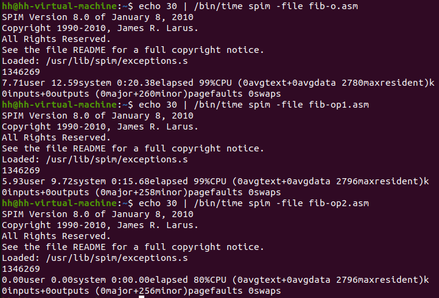

# 实验一：MIPS程序设计

实验时间：2.23 2023

实验人员：黄昊，21300240011

## 1 实验目的

- 熟悉QtSPIM模拟器；
- 熟悉编译器、汇编器和链接器；

- 熟悉MIPS体系结构的计算，包括：
  - MIPS的数据表示；
  - 熟悉MIPS指令格式和寻址方式
  - 熟悉MIPS汇编语言
  - 熟悉MIPS的各种机器代码表示，包括
    - 选择结构；
    - 循环结构；
    - 过程调用：调用与返回、栈、调用约定等；
    - 系统调用。

## 2 实验过程

### 2.1 调试

- p1.asm

  首先使用`ori`指令将立即数40存入\$t2，再使用`ori`指令将立即数17存入\$t3寄存器，最后使用`add`指令将\$t2+\$t3的结果存入\$t3，\$t3寄存器中的值为40和17的和57

- p2.asm

  `ori`指令将40存入\$t2寄存器，使用`lui`指令将\$t2寄存器中的高4字节赋值为0x1234，此时\$t2中的值为0x12340000，再使用`ori $t2, $t2, 40` 指令取或运算将低2位字节赋值为0x28，此时\$t2中内容为0x12340028；

  `li`指令应该与`lui`和`ori`组合使用的效果一样，比较发现QtSPIM将`li`指令翻译成了这两条指令的组合，但是不同的是使用\$at寄存器来保存`lui`指令产生的中间结果0x12340000

- p3.asm

  在数据段中保存了两条以字节为单位的整数A和数组h；

  指令`la $t0, h`将h的地址加载到\$t0寄存器中，在QtSPIM中，这条指令被翻译成了`lui`和`ori`两条指令，分两步分别将h地址的高4字节和低4字节存入\$t0中，并且使用中间寄存器\$at临时保存了地址的高4字节；紧接着的`la $t1, A`操作方式相同，将A数组的起始地址存入\$t1寄存器中；

  `lw $t2, 0($t1)`将\$t1寄存器中存储的内容作为基地址，然后加上偏移量0得到内存地址后从中取出数据，即h的内容40，并存入\$t2中，此时\$t2中内容为40；`lw $t3, 32($t1)`指令以\$t1中内容，即A[0]地址作为基地址，加上偏移量32（8字）得到A[8]的地址，并从中取出A[8]的值存入\$t3中；

  `add`指令将h和A[8]相加，结果存入\$t3中，此时\$t3中结果为0x3b；

  `sw $t3, 48($t1)`指令将\$t3的内容即计算结果存入指定地址中，其中地址为以\$t1寄存器内容即A[0]地址，加上偏移量48（12字）后得到A[12]的地址，此时A[12]的值为59（0x3b）

### 2.2 改写程序

使用一个do...while循环实现循环读入两个数并计算输出两数之和，再根据输入的条件码决定退出还是继续计算

#### syscall实现输入输出

将`syscall code`存储到$v0中，使用`syscall`指令即可根据syscall code值执行对应的操作

- `syscall code 1`可以将$a0中的值以整数输出到屏幕

- `syscall code 4`可以将以\$a0中值作为地址存储的字符串输出到屏幕；

- `syscall code 5`可以实现读取一个整数，读取的整数会被存储在$v0中

首先用数据标识符`.asciiz`将预输出的字符串存储在数据段，然后使用输出字符串的`syscall code 4`将输入提示信息输出到屏幕

~~~assembly
# print "Please enter 1st number:\n"    
li $v0, 4
la $a0, First
syscall
~~~

使用`syscall code 5`从控制台读入整数，将读入到\$v0中的值取出存到对应寄存器中，其中第一个整数存储在\$t2中，第二个输入的整数存储在\$t3中

~~~assembly
# read first num
li $v0, 5
syscall
add $t2, $0, $v0
~~~

使用`add`指令计算两数之和并将结果存储在\$t4中，然后调用使用`syscall code 1`将结果打印到屏幕

~~~assembly
# print sum
li $v0, 1
addi $a0, $t4, 0
syscall 
~~~

#### 循环

将循环主体写在`loop`标签下，计算结束后进入`condition`标签读取是否继续执行的条件码，读取的条件码保存在\$v0中；

使用`beq`指令判断是否为对应值并跳转

如果条件码为1，则跳转到`done`标签结束整个程序；条件码为0则跳转到`loop`继续循环；都不是则跳转到`condition`标签重新读取

~~~assembly
condition:
	beq $v0, 0, loop
	beq $v0, 1, done
	j condition
~~~

### 2.3 C代码翻译成MIPS代码

#### main函数

使用`.word`标签定义数组`arrs`，`arrs`每个元素的大小为一个字，长度为8

将数组`arrs`的起始地址存入\$a1，`arrs`的大小8存入\$a2，作为传递到`sum`函数的实参，寄存器\$a0预留给`syscall`输出结果

使用`syscall`指令输出结果字符串和结果值

#### sum函数

首先开辟栈帧（栈帧大小至少为32）并保存返回地址和会使用到的`callee save`寄存器\$s0和\$s1

~~~assembly
addi $sp, -32
sw $ra, 0($sp)
sw $s0, 4($sp)
sw $s1, 8($sp)
~~~

将main函数传递的参数\$a1和\$a2分别赋值给\$s0和\$s1

\$v1保存返回值同时也是sum值初始化为0，循环变量`idx`保存在\$t0中也初始化为0

> \$v0预留给syscall保存syscall code

累加过程先使用`bge`指令判断循环遍历`idx`是否大于等于数组大小，大于则跳转到`done`标签结束循环，否则继续循环

使用`sll`指令左移2位\$t0，表示循环变量`idx * 4`，因为一个数组元素大小为一个字，数组下标乘4则对应其地址偏移量，将偏移量存储在\$t1中，然后将数组起始地址加上偏移量得到下标对应数字元素的地址，使用`lw`指令取出地址中的值到\$t3中

~~~assembly
sll $t1, $t0, 2 # idx * 4, offset
add $t2, $s0, $t1 # t2 is the address of arrs[idx]
lw $t3, ($t2) # t3 = arrs[idx]
~~~

将结果累加到\$v1中，循环变量加一，然后继续循环

循环结束后回收栈帧并还原之前保存寄存器的值并返回

~~~assembly
done:
    lw $ra, 0($sp)
    lw $s0, 4($sp)
    lw $s1, 8($sp)
    addi $sp, 12
    jr $ra
~~~

### 2.4 优化代码

#### 删减指令进行优化

通过删除fib-.asm中多余的指令实现优化。在递归过程中需要大量创建和回收栈帧，因此这部分的性能消耗较大，但观察代码发现初始化过程中对$fp寄存器的维护并不是必须的，删除后并不影响程序运行结果；

同时程序中的`move`指令也可以根据寄存器的前后关系来删去，比如计算出的`fib(n - 1)`和`fib(n - 2)`的值可以之间通过返回值保存寄存器$v0使用，以及在取参数n时可以之间使用参数保存寄存器\$a0

**修改片段**

~~~assembly
# sw $fp, 24($sp) # preserve the Frame Pointer.
...
# move $t0, $a0 # get n from caller.
# compute fib (n - 1):
sw $a0, 20($sp) # preserve n.
...
# move $t1, $v0 # t1 = fib (n - 1)
lw $t0, 20($sp) # restore n.
...
# move $t2, $v0 # t2 = fib (n - 2)
lw $t1, 16($sp) # restore $t1.
add $v0, $t1, $v0 # $v0 = fib (n - 1) + fib (n - 2)
~~~

> 优化后的程序文件为fib-op1.asm

#### 修改算法进行优化

当n的值较大时，通过删减指令的方式进行优化的效果并不十分明显，因为在递归过程中对栈帧的维护还是会拖慢程序，因此通过将递归过程改为迭代过程来避免因维护栈帧造成的消耗

根据斐波那契数列的递推公式：$f(x)=f(x-1)+f(x-2)$

则有$f(x+1)=f(x)+f(x-1)$，因此每次循环计算出第x个斐波那契数时可根据递推关系计算出下一个斐波那契数，直到计算出第n个斐波那契数

**具体实现**

初始时将返回值初始化为1，并且循环变量从1开始，保证了当参数n为0或1时能返回结果1；

- 循环过程的C代码：

~~~C
int fib(int n)
{
    int a = 1;	// fib(1) = 1
    int b = 1;	// fib(0) = 1
    int c = 1;	// fib(n)
    for (int i = 1; i < n; ++i)
    {
        c = a + b; // fib(x) = fib(x-1) + fib(x-2)
        a = c;	   // fib(x-1) = fib(x)
        b = a;	   // fib(x-2) = fib(x)
    }
    return c;
}
~~~

- MIPS实现：

fib函数没有递归调用过程，并且没有使用`callee save`寄存器，因此可以不开辟栈帧，免去了开辟栈帧的开销

将`fib(n-1)`的值存储在寄存器\$t1中，`fib(n-2)`的值存储在\$t2中，返回值为\$v0，循环变量为\$t0，初始化：

~~~assembly
li $t1, 1   # fib(1) = 1
li $t2, 1   # fib(0) = 1
li $v0, 1   # return value initialize
li $t0, 2   # index = 1
~~~

循环过程先判断循环变量是否大于参数n，大于则结束循环；

使用两条`move`指令实现寄存器值的更新

~~~assembly
loop:
    bgt $t0, $a0, done  # if index > n
    add $v0, $t1, $t2   # v0 = fib(n-1) + fib(n-2)
    move $t1, $t2       # fib(n-1) = fib(n-2)
    move $t2, $v0       # fib(n-2) = fib(n)
    addi $t0, 1         # index++
    j loop

done:
    jr $ra
~~~

> 优化后的程序文件为fib-op2.asm

## 3 实验结论

以参数n=30在spim中运行`fib-o.asm`、`fib-op1.asm`和`fib-op2.asm`，可以看到删减代码对程序略有优化，而通过迭代方式实现的优化程度更高

## 4 实验感想

这次实验让我了解了QtSPIM模拟器的使用和一些基本的MIPS语言用法，学会了使用MIPS语言来表示选择结构、循环结构、函数调用和系统调用，并且深入理解了函数调用过程中的寄存器使用规则以及如何利用栈来保存函数状态，这使我对计算机的底层逻辑有了更加深入的了解。但在实验过程中还是遇到了很多问题，比如在优化代码时，起初我希望通过减少指令数以及减少内存访问来进行优化，但实际效果并不理想，仔细分析后发现在创建和回收栈帧时有大量的内存访问指令，应该是拖慢程序的主要原因，因此通过将递归改为循环的方式来进行优化。

