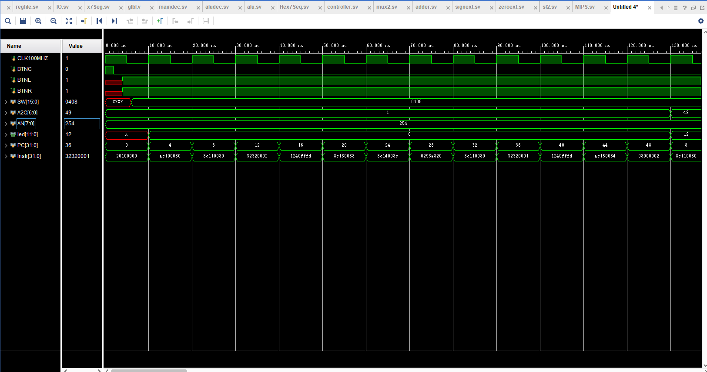
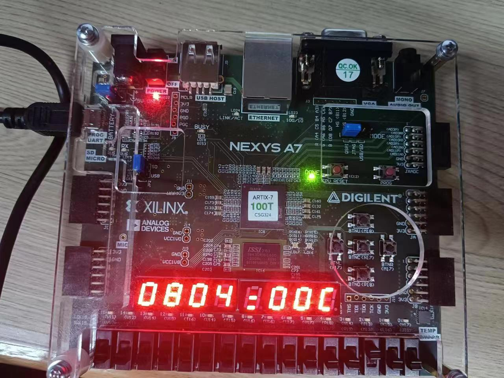
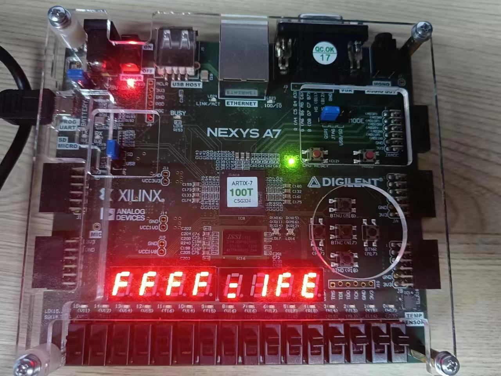

# 实验2：单周期MIPS处理器

实验时间：3.21 2023

实验人员：黄昊，21300240011

## 1 实验目的

- 熟悉Vivado软件；

- 熟悉在Vivado软件下进行硬件设计的流程；

- 设计单周期MIPS处理器，包括：

  - 完成单周期MIPS处理器的设计；
  - 在Vivado软件上进行仿真；

  - 编写MIPS代码验证单周期MIPS处理器；
  - 在NEXYS4 DDR板上进⾏验证

## 2 实验任务

### 2.1 设计单周期MIPS处理器

单周期MIPS处理器包含指令如下

- add, sub, addi
- and, or, andi, ori
- slt, slti
- sw, lw
- beq, bne
- j
- nop

#### 顶层文件

**MIPS_Top.sv**

~~~verilog
module MIPS_Top(
    input   logic        CLK100MHZ,
    input   logic        BTNC,
    input   logic        BTNL,
    input   logic        BTNR,
    input   logic [15:0] SW,
    output  logic [7:0]  AN,
    output  logic [6:0]  A2G,
    output  logic        DP);
    
    logic [31:0] PC, Instr;
    logic [31:0] ReadData, WriteData, DataAdr;
    logic Write;
    
    MIPS mips(.clk(CLK100MHZ),
              .reset(BTNC),
              .pc(PC),
              .instr(Instr), 
              .memwrite(Write), 
              .aluout(DataAdr),
              .writedata(WriteData), 
              .readdata(ReadData));
              
    imem imem(.A(PC[7:2]), 
              .RD(Instr));
    
    dMemoryDecoder dmd(.clk(CLK100MHZ),
                       .reset(BTNC),
                       .btnl(BTNL),
                       .btnr(BTNR),
                       .sw(SW),
                       .an(AN),
                       .a2g(A2G),
                       .dp(DP),
                       .addr(DataAdr[7:0]),                      
                       .writeEN(Write),
                       .writedata(WriteData),
                       .readdata(ReadData));
endmodule
~~~

#### CPU部分设计

CPU主要分为两个部分：数据路径datapath和控制单元controller

| 输入     | 描述                 |
| -------- | -------------------- |
| clk      | 时钟                 |
| reset    | 重置标志             |
| instr    | 指令                 |
| readdata | 数据存储器读取的数据 |

| 输出      | 描述                 |
| --------- | -------------------- |
| pc        | PC值                 |
| aluout    | alu输出              |
| writedata | 写入数据存储器的数据 |
| memwrite  | 数据存储器写使能     |

中间变量连接控制单元和数据路径，用于传递控制单元输出的控制信号，以及数据路径反馈给控制单元的信号

~~~verilog
module MIPS(
    input   logic clk, reset,
    input   logic [31:0] instr,
    input   logic [31:0] readdata,
    output  logic [31:0] pc,
    output  logic [31:0] aluout, writedata,
    output  logic        memwrite );
    
    logic MemtoReg, Branch, PCSrc, Jump,
          ALUSrc, RegDest, RegWrite, ImmExt;
    logic ZF;    
    logic [2:0] ALUControl;
    
    controller c(.opcode(instr[31:26]),
                 .funct(instr[5:0]),
                 .zf(ZF), 
                 .memtoreg(MemtoReg),
                 .alusrc(ALUSrc),
                 .regdest(RegDest),
                 .regwrite(RegWrite),
                 .memwrite(memwrite),
                 .pcsrc(PCSrc),
                 .immext(ImmExt),
                 .jump(Jump),
                 .alucontrol(ALUControl));
                 
    datapath dp(.clk(clk),
                .reset(reset),
                .regwrite(RegWrite),
                .regdest(RegDest),
                .alusrc(ALUSrc),
                .memtoreg(MemtoReg),
                .pcsrc(PCSrc),
                .immext(ImmExt),
                .jump(Jump),
                .alucontrol(ALUControl),
                .readdata(readdata),               
                .instr(instr),
                .aluout(aluout),
                .zf(ZF),
                .pc(pc),
                .writedata(writedata));         
endmodule
~~~

##### 控制单元controller

控制单元分为**maindec**和**aludec**两部分

其中maindec根据指令的**opcode**值判断指令类型并译码输出部分逻辑部件的控制信号以及ALU操作码信号(ALUOp)；aludec根据指令的**funct**和maindec输出的**ALUOp**来译码ALU需要执行的运算操作

控制单元输出的控制信号：

| 信号       | 描述               |
| ---------- | ------------------ |
| memwrite   | 数据存储单元写使能 |
| regwrite   | 寄存器文件写使能   |
| regdest    | wrmux选择信号      |
| alusrc     | srcbmux选择信号    |
| immext     | extmux选择信号     |
| memtoreg   | resmux选择信号     |
| pcsrc      | pcbrmux选择信号    |
| jump       | pcmux选择信号      |
| alucontrol | ALU运算选择信号    |

增加branch和branchbne两个逻辑信号，在执行bne和beq指令时结合zf信号控制pcsrc的输出，使得pc值更新为正确的指令地址

~~~verilog
assign pcsrc = (branch & zf) | (branchbne & (~zf));                 
~~~

**maindec.sv**

maindec根据输入op码对控制信号进行译码，其中R型指令的控制信号全都一致，对于I型指令和J指令则根据具体的op码进行译码

| opcode       | regwrite | regdest | alusrc | branch | memwrite | memtoreg | jump | aluop | immext | branchbne |
| ------------ | -------- | ------- | ------ | ------ | -------- | -------- | ---- | ----- | ------ | --------- |
| R(000000)    | 1        | 1       | 0      | 0      | 0        | 0        | 0    | 010   | 0      | 0         |
| addi(001000) | 1        | 0       | 1      | 0      | 0        | 0        | 0    | 000   | 0      | 0         |
| andi(001100) | 1        | 0       | 1      | 0      | 0        | 0        | 0    | 100   | 1      | 0         |
| ori(001101)  | 1        | 0       | 1      | 0      | 0        | 0        | 0    | 011   | 1      | 0         |
| slti(001010) | 1        | 0       | 1      | 0      | 0        | 0        | 0    | 111   | 0      | 0         |
| lw(100011)   | 1        | 0       | 1      | 0      | 0        | 1        | 0    | 000   | 0      | 0         |
| sw(101011)   | 0        | x       | 1      | 0      | 1        | x        | 0    | 000   | 0      | 0         |
| beq(000100)  | 0        | x       | 0      | 1      | 0        | x        | 0    | 001   | 0      | 0         |
| bne(000101)  | 0        | 0       | 0      | 0      | 0        | 0        | 0    | 001   | 0      | 1         |
| j(000010)    | 0        | x       | x      | x      | 0        | x        | 1    | xxx   | 0      | 0         |

> nop指令32位全都是0，这是一条R-型指令，指令译码后为\$0 = \$0 + \$0，因为\$0寄存器中的值始终为0，所以nop相当于不做任何操作

~~~verilog
module maindec(
    input   logic [5:0] op,
    output  logic memwrite, regwrite, regdest, immext,
                  alusrc, memtoreg, branch, branchbne, jump,
    output  logic [2:0] aluop);
    
    logic [11:0] controls;
    
    assign {regwrite, regdest, alusrc, branch, 
            memwrite, memtoreg, jump, aluop, 
            immext, branchbne} = controls;
    
    always_comb            
    case(op)
        // aluop:
        // 010 -> R 000 -> ADD 001 -> SUB 
        // 001 -> addi 100 -> andi 011 -> ori 111 -> slti
        6'b000000: controls <= 12'b110000001000;  // R
        6'b001000: controls <= 12'b101000000000;  // addi
        6'b001100: controls <= 12'b101000010010;  // andi
        6'b001101: controls <= 12'b101000001110;  // ori
        6'b001010: controls <= 12'b101000011100;  // slti
        6'b100011: controls <= 12'b101001000000;  // lw
        6'b101011: controls <= 12'b0x101x000000;  // sw
        6'b000100: controls <= 12'b0x010x000100;  // beq
        6'b000101: controls <= 12'b000000000101;  // bne
        6'b000010: controls <= 12'b0xxx0x1xxx00;  // j
        default:   controls <= 12'bxxxxxxxxxxxx;  // ???
    endcase     
       
endmodule
~~~

**aludec.sv**

aludec根据funct码和maindec输出的aluop进行译码，其中只有R型指令需要根据funct码来判断具体需要alu进行的操作，其他指令则根据aluop码进行译码；因为对指令进行拓展，所有aluop码也要拓展到3为才能对所有的指令进行译码

~~~verilog
module aludec(
    input   logic [2:0] aluop,
    input   logic [5:0] f,
    output  logic [2:0] aluctrl);
    
    always_comb
    case(aluop)
        3'b000: aluctrl <= 3'b010; // ADD
        3'b001: aluctrl <= 3'b110; // SUB
        3'b010: case(f)
            6'b000000: aluctrl <= 3'b010; // nop
            6'b100000: aluctrl <= 3'b010; // add
            6'b100010: aluctrl <= 3'b110; // sub
            6'b100100: aluctrl <= 3'b000; // and
            6'b100101: aluctrl <= 3'b001; // or
            6'b101010: aluctrl <= 3'b111; // slt
            default:   aluctrl <= 3'bxxx; // ???
            endcase
        3'b100:  aluctrl <= 3'b000; // andi
        3'b011:  aluctrl <= 3'b001; // ori
        3'b111:  aluctrl <= 3'b111; // slt
        default: aluctrl <= 3'bxxx; // ??? 
    endcase            
            
endmodule
~~~

##### 数据路径datapath

数据路径部分包含了CPU执行过程中的所有逻辑部件；

逻辑部件的控制信号来自控制单元controller中的输出，指令instr根据PC控制逻辑输出PC值再从指令存储器中取出指令得到

主要的输出信号有：

- zf：ALU零标志位
- writedata：数据存在单元写使能
- aluout：ALU逻辑运算结果输出
- pc：PC值

主要的输入信号有：

- readdata：数据存储器读取的数据
- instr：指令寄存器读取的指令
- 来自controller的控制信号

**PC控制逻辑**

PC值由寄存器pcreg更新，当reset信号上升沿触发时，PC值被重置为0；当时钟信号clk上升沿到达时，PC值更新为寄存器的输入；

寄存器的输入则由两个二路选择器pcbrmux和pcmux进行选择，选择信号由controller给出

- pcbrmux：根据选择信号pcsrc判断bne和beq指令是否执行跳转，地址为下一条pc值加上立即数符号拓展值
- pcmux：根据选择信号jump判断是否为j指令进行跳转，地址为pc值高4为并上指令低26位再在最后补两个0

**寄存器控制逻辑**

寄存器文件有两个读寄存器地址A1和A2，对应读取的数据内容RD1和RD2；以及一个写寄存器地址A3，对应写入的数据内容WD3

根据指令以固定的格式从寄存器文件的两个读取地址中取出数据RD1和RD2；当时钟上升沿到达时，如果写使能WE3为1，则将数据WD3写入地址A3中

对于要写入的数据和数据地址，以及寄存器文件输出的数据，则根据控制信号来进行筛选将正确的数据传入ALU以及写回寄存器文件

- wrmux：根据控制信号resdest判断寄存器写回地址，因为I型指令和R型指令的写寄存器地址不相同

  > I型指令为instr[15:11]，R型指令为instr[20:16]

- resmux：根据控制信号memtoreg判断写入寄存器的值来自ALU输出还是数据存储器

- extmux：根据控制信号immext判断立即数为符号位拓展还是零拓展

- se和ze：符号位拓展和零拓展逻辑单位

**ALU控制逻辑**

ALU根据alucontrol信号选择对应的运算将两个操作数srca和srcb进行运算

| operate | alucontrol |
| ------- | ---------- |
| add     | 010        |
| sub     | 110        |
| and     | 000        |
| or      | 001        |
| slt     | 111        |

运算结束后根据运算结果判断是否为0输出zf信号

**alu.sv**

~~~verilog
module alu(
    input   logic [31:0] srca, srcb,
    input   logic [2:0] ctr,
    output  logic [31:0] out,
    output  logic zf);
    
    logic [32:0] temp;
    
    always_comb
    begin
        temp = 33'b0;
        case(ctr)
            3'b000: out = srca & srcb; // AND
            3'b001: out = srca | srcb; // OR
            3'b010:         // ADD
                begin
                    temp = {1'b0, srca} + {1'b0, srcb};
                    out = temp[31:0];
                end
                    
            3'b110:         // SUB
                begin
                    temp = {1'b0, srca} - {1'b0, srcb};
                    out = temp[31:0];
                end
            3'b111:         // SLT
                begin
                    out = srca < srcb ? 1 : 0;
                end
        endcase
        if(out == 32'b0) zf = 1;
        else             zf = 0;
    end
    
endmodule
~~~

**datapath.sv**

~~~verilog
module datapath(
    input   logic clk, reset,
    input   logic regwrite, regdest, jump, immext,
                  alusrc, memtoreg, pcsrc,
    input   logic [2:0] alucontrol,
    input   logic [31:0] readdata,
    input   logic [31:0] instr,
    output  logic zf,
    output  logic [31:0] pc, writedata, aluout);
    
    logic [4:0] WriteReg;
    logic [31:0] PCnext, PCnextBr, PCplus4, PCBranch;
    logic [31:0] SignImm, SignImmSh, ZeroImm, Imm;
    logic [31:0] SrcA, SrcB;
    logic [31:0] Result;
    
    // next PC logic
    flopr #(32) pcreg(.clk(clk), .reset(reset), .out(pc), .in(PCnext));                                         
    adder       pcadder1(.a(32'b100), .b(pc), .y(PCplus4));
    sl2         immsh(.in(SignImm), .out(SignImmSh));
    adder       pcadder2(.a(PCplus4), .b(SignImmSh), .y(PCBranch));                                     
    mux2 #(32)  pcbrmux(.select(pcsrc), .t(PCBranch), .f(PCplus4), .y(PCnextBr));
    mux2 #(32)  pcmux(.select(jump), .t({PCplus4[31:28], instr[25:0], 2'b00}), .f(PCnextBr), .y(PCnext)); 
    
    //register file logic
    regfile     rf(.clk(clk),
                   .WE3(regwrite), 
                   .A1(instr[25:21]), 
                   .A2(instr[20:16]),
                   .A3(WriteReg),
                   .WD3(Result),
                   .RD1(SrcA),
                   .RD2(writedata));
    mux2 #(5)   wrmux(.select(regdest), .t(instr[15:11]), .f(instr[20:16]), .y(WriteReg)); 
    mux2 #(32)  resmux(.select(memtoreg), .t(readdata), .f(aluout), .y(Result));
    signext     se(.in(instr[15:0]), .out(SignImm));
    zeroext     ze(.in(instr[15:0]), .out(ZeroImm));
    mux2 #(32)  extmux(.select(immext), .t(ZeroImm), .f(SignImm), .y(Imm));
    
    // ALU logic
    mux2 #(32)  srcbmux(.select(alusrc), .t(Imm), .f(writedata), .y(SrcB));
    alu         alu(.srca(SrcA), 
                    .srcb(SrcB), 
                    .ctr(alucontrol), 
                    .out(aluout), 
                    .zf(zf));               
                        
endmodule
~~~

**flop.sv**

~~~verilog
module flopr#(parameter N = 8)(
    input   logic clk, reset,
    input   logic [N - 1:0] in,
    output  logic [N - 1:0] out);
    
    always_ff @(posedge clk, posedge reset)
        if (reset) out <= 'b0;
        else       out <= in;
            
endmodule
~~~

**adder.sv**

~~~verilog
module adder(
    input   logic [31:0] a, b,
    output  logic [31:0] y);
    
    assign y = a + b;
endmodule
~~~

**sl2.sv**

~~~verilog
module sl2(
    input   logic [31:0] in,
    output  logic [31:0] out);
    
    assign out = in << 2;
    
endmodule
~~~

**mux2.sv**

~~~verilog
module mux2#(parameter N = 32)(
    input   logic select,
    input   logic [N - 1:0] t, f,
    output  logic [N - 1:0] y);
    
    assign y = select ? t : f;
endmodule
~~~

**regfile.sv**

~~~verilog
module regfile(
    input   logic clk, WE3,
    input   logic [4:0] A1, A2, A3,
    input   logic [31:0] WD3,
    output  logic [31:0] RD1, RD2);
    
    logic [31:0] rf[31:0];
    
    always_ff @(posedge clk)
        if (WE3) rf[A3] <= WD3;
    
    assign RD1 = (A1 != 0 ) ? rf[A1] : 0;
    assign RD2 = (A2 != 0 ) ? rf[A2] : 0;

endmodule
~~~

**signext.sv**

~~~verilog
module signext(
    input   logic [15:0] in,
    output  logic [31:0] out);
    
    assign out = {{16{in[15]}}, in};
        
endmodule
~~~

**zeroext.sv**

~~~verilog
module zeroext(
    input   logic [15:0] in,
    output  logic [31:0] out);
    
    assign out = {{16{1'b0}}, in};
    
endmodule
~~~

##### 指令存储器和数据存储器

指令存储器根据输入PC值的第3到第8位（6位）输出对应地址位置的指令instr

> 因为指令存储器的大小设计为$2^6$，且pc值的低2位始终为00，所以输入的地址为pc[7:2]

数据存储器大小为$2^8$，根据输入地址A（8位）读取地址中的数据RD；如果写使能为1，当时钟上升沿到达时，将写入数据WD写到地址A中

**imem.sv**

~~~verilog
module imem(
    input   logic [5:0] A,
    output  logic [31:0] RD);
    
    logic [31:0] ROM[63:0];
    
    initial
        $readmemh("memfile.dat", ROM);
    assign RD = ROM[A];
endmodule
~~~

**mipsmem.sv**

~~~verilog
module mipsmem(
    input   logic clk,
    input   logic [31:0] WD,
    input   logic [7:0] A,
    input   logic WE,
    output  logic [31:0] RD);
    
    logic [31:0] RAM[255:0];
    
    assign RD = RAM[A];
    
    always_ff @(posedge clk)
        if (WE)
            RAM[A] <= WD;          
endmodule
~~~

#### IO接口部分设计

> IO接口设计参考自参考资料的新方案

##### 存储器译码模块

增加dMemoryDecoder模块，根据指令地址译码控制IO接口输入输出或者数据存储器输入

设置IO接口的数据存储地址

- 0x8C(10001100)：Switch高8位端口
- 0x88(10001000)：Switch低8位端口
- 0x84(10000100)：led端口
- 0x80(10000000)：状态端口

当执行指令lw或sw，且ALU输出的地址为IO接口地址时，数据的存取来自IO接口

初始时IO状态设为00，led和switch都置为0；当BTNR按下时表示从switch按钮读取数据，并根据地址读取对应的switch端口；当BTNL按下时，表示将led端口地址中的值输出到led进行显示；led端口地址的写入由当写使能pWrite控制，当写使能为1且地址信号为0x84时，在时钟上升沿到达时将pWritedata写入led端口地址

存储器内容的读取通过一个二路选择器rdmux进行选择，选择信号为指令地址的第8位，对非IO接口地址从数据存储器中输出数据(readdata1)，IO接口地址从IO接口中输出数据(readdata2)

**dMemoryDecoder.sv**

~~~verilog
module dMemoryDecoder(
    input   logic clk, reset,
    input   logic btnl, btnr,
    input   logic [15:0] sw,
    output  logic [7:0]  an,
    output  logic [6:0]  a2g,
    output  logic        dp,
    input   logic [7:0] addr,
    input   logic writeEN,
    input   logic [31:0] writedata,
    output  logic [31:0] readdata);
    
    logic pRead, pWrite, WE;
    logic [31:0] readdata1, readdata2;
    logic [11:0] led;
    
    assign pRead = addr[7];
    assign pWrite = addr[7] & writeEN;
    assign WE = writeEN & (addr[7] == 0);
    
    mipsmem dmem(.clk(clk),               
                 .A(addr),
                 .WE(WE),
                 .RD(readdata1),
                 .WD(writedata)); 
   
    IO io(.clk(clk),
          .reset(reset),
          .pRead(pRead),
          .pWrite(pWrite),
          .addr(addr[3:2]),
          .pWriteData(writedata),
          .sw(sw),
          .btnl(btnl),
          .btnr(btnr),
          .led(led),
          .pReadData(readdata2));
    
    mux2 #(32) rdmux(.select(addr[7]), .t(readdata2), .f(readdata1), .y(readdata));
       
    x7Seg x7(.clk(clk),
             .reset(reset),
             .digit({sw, 4'b0000, led}),
             .a2g(a2g),
             .an(an),
             .dp(dp));                                
endmodule
~~~

##### 七段数码管显示

七段数码管控制模块为x7Seg，通过时钟分配器clkdiv控制时钟频率以实现8个七段数码管同时亮起，输入信号digit为要在七段数码管显示的内容

Hex7Seg模块为七段数码管译码器，根据输入的十六进制数值，控制七段数码管进行显示

**x7Seg.sv**

~~~verilog
module x7Seg(
    input   logic clk, reset,
    input   logic [31:0] digit,
    output  logic [6:0] a2g,
    output  logic [7:0] an,
    output  logic       dp);
    
    logic [2:0] s;
    logic [19:0] clkdiv;
    logic [4:0] data;
    
    assign dp = 1;
    assign s = clkdiv[19:17];
    always_comb
        case(s)
            0:  
            begin
                an   = 8'b11111110;
                data = {1'b0, digit[3:0]};
            end 
            1:
            begin
                an   = 8'b11111101;
                data = {1'b0, digit[7:4]};
            end   
            2:
            begin
                an   = 8'b11111011;
                data = {1'b0, digit[11:8]};
            end 
            3: // = 
            begin
                an   = 8'b11110111;
                data = {1'b1, digit[15:12]};// =
            end 
            4: 
            begin
                an   = 8'b11101111;
                data = {1'b0, digit[19:16]};
            end 
            5: 
            begin
                an   = 8'b11011111;
                data = {1'b0, digit[23:20]};
            end  
            6:  
            begin
                an   = 8'b10111111;
                data = {1'b0, digit[27:24]};
            end 
            7: 
            begin
                an   = 8'b01111111;
                data = {1'b0, digit[31:28]};
            end 
            default: an = 8'b11111111;
        endcase
        
    always @(posedge clk, posedge reset)
        if (reset == 1) clkdiv <= 0;
        else clkdiv <= clkdiv + 1;
        
    Hex7Seg s7(.data(data), .a2g(a2g));         
endmodule
~~~

**Hex7Seg.sv**

~~~verilog
module Hex7Seg(
    input logic [4:0] data,
    output logic [6:0] a2g);
    
    always_comb
        case (data) 
            'h0: a2g = 7'b0000001; 
            'h1: a2g = 7'b1001111; 
            'h2: a2g = 7'b0010010; 
            'h3: a2g = 7'b0000110; 
            'h4: a2g = 7'b1001100; 
            'h5: a2g = 7'b0100100; 
            'h6: a2g = 7'b0100000; 
            'h7: a2g = 7'b0001111; 
            'h8: a2g = 7'b0000000; 
            'h9: a2g = 7'b0000100; 
            'hA: a2g = 7'b0001000; 
            'hB: a2g = 7'b1100000; 
            'hC: a2g = 7'b0110001; 
            'hD: a2g = 7'b1000010; 
            'hE: a2g = 7'b0110000; 
            'hF: a2g = 7'b0111000; 
            'h10: a2g = 7'b1110110; //=
        default: a2g = 7'b0000001; //0
        endcase
endmodule
~~~

### 2.2仿真

在Vivado软件对单周期处理器进行仿真

测试指令：

**memfile.dat**

~~~assembly
  main: addi $2, $0, 5		# 20020005
		addi $3, $0, 12 	# 2003000C
		addi $7, $3, -9 	# 2067FFF7
		or 	 $4, $7, $2 	# 00E22025
		and  $5, $3, $4 	# 00642824
		add  $5, $5, $4 	# 00A42824
		beq  $5, $7, end 	# 10A7000A
		slt  $4, $3, $4 	# 0064202A
		beq  $4, $0, around	# 10800001
		addi $5, $0, 0 		# 20050000
around: slt  $4, $7, $2 	# 00E2202A
		add  $7, $4, $5 	# 00853820
		sub  $7, $7, $2 	# 00E2202A
		sw   $7, 68($3) 	# AC670044
		lw   $2, 80($0) 	# 8C020050
		j    end 			# 08000011
		addi $2, $0, 1 		# 20020001
   end: sw   $2, 84($0)		# AC020054
~~~

仿真结果：

**memfile1.dat**

~~~assembly
main:	addi $2, $0, 5	  # 20020005
		ori  $4, $2, 7	  # 34440007
		andi $5, $2, 4	  # 30450004
		bne	 $5, $0, end  # 14A00001
		addi $4, $0, 1	  # 20020001
end: 	sw   $4, 84($0)   # AC040054
~~~

仿真结果：

### 2.3验证

在Vivado软件上对IO接口部分进行仿真

测试指令：

~~~assembly
main:	
	addi $s0, $0, 0			# 20100000
	sw   $s0, 0x80($0)  	# AC100080
chkSwitch:
	lw	 $s1, 0x80($0) 	 	# 8C110080
	andi $s2, $s1, 0x2  	# 32320002
	beq	 $s2, $0, chkSwitch # 1240FFFD
	lw	 $S3, 0x80($0)		# 8C130088
	lw	 $s4, 0x8C($0)		# 8C14008C
	add  $s5, $s4, $s3  	# 0293A820
chkLED:
	lw   $s1, 0x80($0)		# 8C110080
	andi $s2, $s1, 0x1		# 32320001
	beq	 $s2, $0, chkLED 	# 1240FFFFD
	sw	 $s5, 0x84($0)		# AC150084
	j	 chkSwitch			# 08000002
~~~

仿真结果：

##### 

### 2.4板上验证

板上验证实验结果：

## 3 实验感想

很高兴这次实验成功实现了MIPS单周期处理器，实验过程中遇到了很多问题，比如对IO接口的实现逻辑不理解，以及实验过程中出现的各种bug，但经过不断调试，最终还是解决了问题
