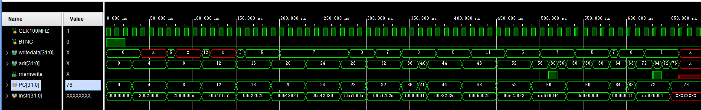
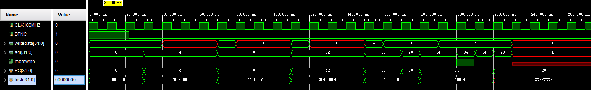

# 实验3：多周期MIPS处理器

实验时间：5.6 2023

实验人员：黄昊，21300240011

## 1 实验目的

实验目的：

- 设计多周期MIPS处理器，包括
  - 完成多周期MIPS处理器的设计；
  - 在Vivado软件上进行仿真；
  - 编写MIPS代码验证多周期MIPS处理器；
  - 在NEXYS4 DDR板上进行验证(**都不做要求**)。

## 2 实验任务

### 2.1 设计多周期MIPS处理器

多周期MIPS处理器包含的指令如下

- 基本

  - lw，sw
  - add，sub，and，or，slt
  - beq，
  - addi，~~subi~~，slti
  - j

  > MIPS中没有subi指令，改为slti指令实现

- 拓展
  - bne
  - addi，ori
  - ~~nop~~

#### 顶层文件

**MIPS_Top.sv**

~~~verilog
module MIPS_Top(
    input   logic   CLK100MHZ,
    input   logic   BTNC);
    
    logic [31:0] ReadData, WriteData, Adr;
    logic Write;
    
    MIPS mips(.clk(CLK100MHZ),
              .reset(BTNC),
              .memwrite(Write), 
              .adr(Adr),
              .writedata(WriteData), 
              .readdata(ReadData));
    
    Memory IDMemory(.clk(CLK100MHZ),
                    .A(Adr[9:2]),                      
                    .WE(Write),
                    .WD(WriteData),
                    .RD(ReadData));
endmodule
~~~

#### MIPS处理器

MIPS处理器主要分为数据路径和控制单元两部分，数据路径是指令处理的主要通路，控制单元以有限状态机的形式对每条指令的不同处理阶段发送控制信号

**MIPS.sv**

~~~verilog
module MIPS(
    input   logic   clk, reset,
    input   logic [31:0] readdata,
    output  logic   memwrite,
    output  logic [31:0] adr,
    output  logic [31:0] writedata);
    
    logic [5:0] Funct, Op;
    logic Zero;
    
    logic [2:0] ALUControl;
    logic [1:0] ALUSrcB, PCSrc;
    logic ALUSrcA, IorD, IRWrite, MemtoReg,
          PCEN, RegDst, RegWrite;
          
    ControlUnit c(.clk(clk),
                  .funct(Funct),
                  .opcode(Op),
                  .reset(reset),
                  .zf(Zero),
                  .alucontrol(ALUControl),
                  .alusrcb(ALUSrcB),
                  .pcsrc(PCSrc),
                  .alusrca(ALUSrcA),
                  .iord(IorD),
                  .irwrite(IRWrite),
                  .memtoreg(MemtoReg),
                  .pcen(PCEN),
                  .regdst(RegDst),
                  .regwrite(RegWrite),
                  .memwrite(memwrite));
                
    datapath dp(.clk(clk),
                .reset(reset),
                .alucontrol(ALUControl),
                .alusrca(ALUSrcA),
                .alusrcb(ALUSrcB),
                .iord(IorD),
                .irwrite(IRWrite),
                .memtoreg(MemtoReg),  
                .pcen(PCEN),        
                .pcsrc(PCSrc),
                .readdata(readdata),
                .regdst(RegDst),
                .regwrite(RegWrite),
                .adr(adr),
                .funct(Funct),
                .op(Op),
                .writedata(writedata),
                .zero(Zero));
                
endmodule
~~~

##### 数据路径

输入信号：

| 信号       | 描述                       |
| ---------- | -------------------------- |
| clk        | 时钟                       |
| reset      | 重置信号                   |
| alucontrol | alu运算控制信号            |
| alusrcb    | alu的b输入端选择信号       |
| pcsrc      | pc更新值选择信号           |
| alusrca    | alu的a输入端选择信号       |
| irwrite    | 指令输出锁存器写使能信号   |
| memtoreg   | 寄存器文件写入内容选择信号 |
| pcen       | pc锁存器写使能信号         |
| regdst     | 目标寄存器选择信号         |
| regwrite   | 寄存器写使能信号           |
| iord       | 存储单元写入内容选择信号   |
| readdata   | 从存储单元读取的内容       |

输出信号：

| 信号      | 描述                       |
| --------- | -------------------------- |
| adr       | 输出到存储单元的地址或数据 |
| funct、op | 输出到控制单元进行译码     |
| writedata | 写入存储单元的内容         |
| zero      | alu的零标志位信号          |

**datapath.sv**

~~~verilog
module datapath(
    input   logic clk, reset,
    input   logic [2:0] alucontrol,
    input   logic [1:0] alusrcb, pcsrc,
    input   logic alusrca, irwrite, memtoreg,
                  pcen, regdst, regwrite, iord,
    input   logic [31:0] readdata,
    output  logic [31:0] adr,
    output  logic [5:0] funct, op,
    output  logic [31:0] writedata,
    output  logic zero);
    
    logic [31:0] PC, PCNext;
    
    logic [31:0] Instr, Data;
    
    logic [4:0]  WriteReg;
    logic [31:0] SignImm, SignImmSh;
    logic [31:0] RD1, RD2, A, B;
    
    logic [31:0] SrcA, SrcB;
    logic [31:0] ALUResult, ALUOut, Result;
    
    // PC logic
    mux3 #(32)  pcmux(.select(pcsrc), .d0(ALUResult), .d1(ALUOut), .d2({PCNext[31:28], Instr[25:0], 2'b00}), .y(PCNext));
    latch #(32) pcreg(.clk(clk),
                      .reset(reset), 
                      .en(pcen), 
                      .in(PCNext),
                      .out(PC));
    mux2 #(32)  idmux(.select(iord), .t(ALUOut), .f(PC), .y(adr));
    
    // Memory logic
    latch #(32) instrreg (.clk(clk),
                          .reset(reset),
                          .en(irwrite),
                          .in(readdata),
                          .out(Instr));
                          
    assign op = Instr[31:26];
    assign funct = Instr[5:0];
                             
    flopr #(32) datareg(.clk(clk),
                        .reset(reset),
                        .in(readdata),
                        .out(Data));
    
    // Register file logic 
    regfile     rf(.clk(clk),
                   .WE3(regwrite), 
                   .A1(Instr[25:21]), 
                   .A2(Instr[20:16]),
                   .A3(WriteReg),
                   .WD3(Result),
                   .RD1(RD1),
                   .RD2(RD2));
    mux2 #(5)   wrmux(.select(regdst), .t(Instr[15:11]), .f(Instr[20:16]), .y(WriteReg));
    mux2 #(32)  resmux(.select(memtoreg), .t(Data), .f(ALUOut), .y(Result));
    signext     se(.in(Instr[15:0]), .out(SignImm));
    sl2         immsh(.in(SignImm), .out(SignImmSh));
    flopr #(32) rd1reg(.clk(clk), .reset(reset), .in(RD1), .out(A));
    flopr #(32) rd2reg(.clk(clk), .reset(reset), .in(RD2), .out(B));
    assign writedata = B;
    // ALU logic 
    mux2 #(32) srcamux(.select(alusrca), .t(A), .f(PC), .y(SrcA));
    mux4 #(32) srcbmux(.select(alusrcb), .d0(B), .d1(4), .d2(SignImm), .d3(SignImmSh), .y(SrcB));
    alu        alu(.srca(SrcA), 
                   .srcb(SrcB), 
                   .ctr(alucontrol), 
                   .out(ALUResult), 
                   .zf(zero));   
    flopr #(32) outreg(.clk(clk), .reset(reset), .in(ALUResult), .out(ALUOut));
                                        
endmodule
~~~

**PC控制逻辑**

PC值的更新数据来自一个3路选择器pcmux，由pcsrc信号进行选择，三个数据分别为

- PC+1（00）
- Branch指令跳转地址（01）
- J指令跳转地址（10）

PC值保存在带写使能的锁存器pcreg中，避免数据竞争

**存储单元控制逻辑**

存储单元中包括数据和指令，因此输入的地址为PC值作为指令的地址，或者lw和sw指令通过ALU计算出的指令地址，需要通过一个二路选择器idmux选择正确的地址，由iord信号控制

写入存储单元的内容为数据，由sw指令写入，写入的内容来自sw指令的rt寄存器，即寄存器文件的RD2输出

输出的内容分为数据和指令两种情况，指令输出到锁存器instrreg中避免数据冲突，数据则只需要在下一个周期输出到寄存器文件中保存

**寄存器控制逻辑**

寄存器文件输入：

- clk：时钟
- WE3：写使能信号，regwrite信号控制
- A1、A2：两个源寄存器，通过指令译码输入
- A3：目的寄存器
- WD3：写入目的寄存器数据

寄存器文件输出：

- RD1、RD2：对应两个源寄存器的数据

写使能信号由regwrite信号控制

两个输入的源寄存器由指令译码后得到

因为R-型和I-型指令的目的寄存器不同，因此由一个二路选择器wrmux进行选择，选择信号为regdst

写入的数据也有可能来自存储单元或者ALU输出，因此由resmux选择器进行选择，控制信号为memtoreg

输出的两个寄存器内容保存在两个触发器中，在下一个时钟周期到达时输出到ALU运算

此时指令以及完成译码，可以进行符号拓展和移位操作为后续运算做准备

**regfile.sv**

~~~verilog
module regfile(
    input   logic clk, WE3,
    input   logic [4:0] A1, A2, A3,
    input   logic [31:0] WD3,
    output  logic [31:0] RD1, RD2);
    
    logic [31:0] rf[31:0];
    
    always_ff @(posedge clk)
        if (WE3) rf[A3] <= WD3;
    
    assign RD1 = (A1 != 0 ) ? rf[A1] : 0;
    assign RD2 = (A2 != 0 ) ? rf[A2] : 0;

endmodule
~~~

**ALU控制逻辑**

A端输入值（srcamux选择，alusrca信号控制）

- PC：计算PC+1
- A：寄存器文件的RD1输出

B端输入值（srcbmux选择，alusrcb信号控制）

- B（00）：寄存器文件RD2输出
- 4（01）：计算PC+1
- SignImm：符号位拓展后的立即数值，用于I-型
- SignImmSh：SignImm左移2位后的值，用于Branch指令计算跳转地址

输出的两个操作数作为ALU的两个输入，ALU的运算由alucontrol信号控制，同时输出zero信号

| alucontrol | 操作 |
| ---------- | ---- |
| 000        | AND  |
| 001        | OR   |
| 010        | ADD  |
| 110        | SUB  |
| 111        | SLT  |

输出结果保存到outreg中，下一个时钟周期到达时输出到PC控制逻辑PC跳转地址或存储单元数据输入

**alu.sv**

~~~verilog
module alu(
    input   logic [31:0] srca, srcb,
    input   logic [2:0] ctr,
    output  logic [31:0] out,
    output  logic zf);
    
    logic [32:0] temp;
    
    always_comb
    begin
        temp = 33'b0;
        case(ctr)
            3'b000: out = srca & srcb; // AND
            3'b001: out = srca | srcb; // OR
            3'b010:         // ADD
                begin
                    temp = {1'b0, srca} + {1'b0, srcb};
                    out = temp[31:0];
                end
                    
            3'b110:         // SUB
                begin
                    temp = {1'b0, srca} - {1'b0, srcb};
                    out = temp[31:0];
                end
            3'b111:         // SLT
                begin
                    out = srca < srcb ? 1 : 0;
                end
        endcase
        if(out == 32'b0) zf = 1;
        else             zf = 0;
    end
    
endmodule
~~~

**数据路径中的逻辑单元**

**mux2.sv**

~~~verilog
module mux2 #(parameter N = 32)(
    input   logic select,
    input   logic [N - 1:0] t, f,
    output  logic [N - 1:0] y);
    
    assign y = select ? t : f;
endmodule
~~~

**mux3.sv**

~~~verilog
module mux3 #(parameter N = 32)(
    input   logic [1:0] select,
    input   logic [N - 1:0] d0, d1, d2, 
    output  logic [N - 1:0] y);

    assign y = select[1] ? d2 : (select[0] ? d1 : d0);
        
endmodule
~~~

**mux4.sv**

~~~verilog
module mux4 #(parameter N = 32)(
    input   logic [1:0] select,
    input   logic [N - 1:0] d0, d1, d2, d3, 
    output  logic [N - 1:0] y);
    
    assign y = select[1] ? (select[0] ? d3 : d2) : (select[0] ? d1 : d0);
endmodule
~~~

**flopr.sv**

~~~verilog
module flopr#(parameter N = 8)(
    input   logic clk, reset,
    input   logic [N - 1:0] in,
    output  logic [N - 1:0] out);
    
    always_ff @(posedge clk, posedge reset)
        if (reset) out <= 'b0;
        else       out <= in;
            
endmodule
~~~

**latch.sv**

~~~verilog
module latch #(parameter N = 8)(
    input   logic clk, reset,
    input   logic en,
    input   logic [N-1:0] in,
    output  logic [N-1:0] out);
    
    always_ff @(posedge clk, posedge reset)
        if (reset)   out <= 'b0;
        else if (en) out <= in;
endmodule
~~~

**sl2.sv**

~~~verilog
module sl2(
    input   logic [31:0] in,
    output  logic [31:0] out);
    
    assign out = in << 2;    
endmodule
~~~

**signext.sv**

~~~verilog
module signext(
    input   logic [15:0] in,
    output  logic [31:0] out);
    
    assign out = {{16{in[15]}}, in};
endmodule
~~~

##### 控制单元

控制单元分为**maindec**和**aludec**两部分，根据译码后输入的opcode和funct以及ALU的zero信号来输出指令在不同执行阶段的控制信号

控制信号输出：

| 信号       | 描述                 |
| ---------- | -------------------- |
| memwrite   | 数据存储单元写使能   |
| regwrite   | 寄存器文件写使能     |
| regdet     | wrmux选择信号        |
| alusrcb    | srcbmux选择信号      |
| alusrca    | srcamux选择信号      |
| irwrite    | 指令输出锁存器写使能 |
| memtoreg   | resmux选择信号       |
| pcsrc      | pcmux选择信号        |
| iord       | idmux选择信号        |
| alucontrol | ALU运算选择信号      |
| pcen       | PC锁存器写使能信号   |

增加pcwrite（由maindec输出）、branch和branchbne三个信号，控制pcen信号的输出逻辑

~~~verilog
assign pcen = ((branch & zf) | (branchbne & (~zf))) | pcwrite;
~~~

**ControlUnit.sv**

~~~verilog
module ControlUnit(
    input   logic clk, reset,
    input   logic [5:0] funct, opcode,
    input   logic zf, 
    output  logic [2:0] alucontrol,
    output  logic [1:0] alusrcb, pcsrc,
    output  logic alusrca, irwrite, memtoreg,
                  pcen, regdst, regwrite, iord,
    output  logic memwrite);
    
    logic branch, branchbne;
    logic pcwrite;
    logic [2:0] aluop;
    
    maindec md(.clk(clk),
               .reset(reset),
               .op(opcode),
               .memwrite(memwrite),
               .regwrite(regwrite),
               .regdst(regdst),
               .memtoreg(memtoreg),
               .branch(branch),
               .branchbne(branchbne),
               .alusrca(alusrca),
               .alusrcb(alusrcb),
               .pcsrc(pcsrc),
               .aluop(aluop),
               .pcwrite(pcwrite),
               .irwrite(irwrite),
               .iord(iord));
               
    aludec ad(.aluop(aluop),
              .f(funct),
              .aluctrl(alucontrol));       
    
    assign pcen = ((branch & zf) | (branchbne & (~zf))) | pcwrite; 
endmodule
~~~

**maindec.sv**

maindec是主要的控制信号输出逻辑，通过有限状态机实现

因为控制信号数量较少，因此采用直接控制法对微指令进行编码

所有指令都需要经过**FETCH**和**DECODE**两个时钟周期来取指和译码

此外，每条指令自身还要执行的状态：

- R-型（4个周期）
  - **RTYPEEX**	ALU运算
  - **RTYPEWB**   结果写回寄存器
- lw（5个周期）
  - **MEMADR**	计算地址
  - **MEMRD**       读取存储单元
  - **MEMWR**      写回寄存器
- sw（4个周期）
  - **MEMADR**	计算地址
  - **MEMWR**      写回寄存器
- beq、bne（3个周期）
  - **BEQEX**、**BNEEX**  判断是否相等或不等
- I-型指令（4个周期）
  - **\*\*IEX** 		 对应操作执行ALU运算
  - **\*\*IWB**         对应操作写回寄存器
- J（3个周期）
  - **JEX**			  执行跳转

每个状态对应的微指令编码

|             | pcwrite | memwrite | irwrite | regwrite | alusrca | branch | iord | memtoreg | regdst | alusrcb | pcsrc | aluop | branchbne |
| ----------- | ------- | -------- | ------- | -------- | ------- | ------ | ---- | -------- | ------ | ------- | ----- | ----- | --------- |
| **FETCH**   | 1       | 0        | 1       | 0        | 0       | 0      | 0    | 0        | 0      | 01      | 00    | 000   | 0         |
| **DECODE**  | 0       | 0        | 0       | 0        | 0       | 0      | 0    | 0        | 0      | 11      | 00    | 000   | 0         |
| **MEMADR**  | 0       | 0        | 0       | 0        | 1       | 0      | 0    | 0        | 0      | 10      | 00    | 000   | 0         |
| **MEMRD**   | 0       | 0        | 0       | 0        | 0       | 0      | 1    | 0        | 0      | 00      | 00    | 000   | 0         |
| **MEMWB**   | 0       | 1        | 0       | 1        | 0       | 0      | 0    | 1        | 0      | 00      | 00    | 000   | 0         |
| **MEMWR**   | 0       | 0        | 0       | 0        | 0       | 0      | 1    | 0        | 0      | 00      | 00    | 000   | 0         |
| **RTYPEEX** | 0       | 0        | 0       | 0        | 1       | 0      | 0    | 0        | 0      | 00      | 00    | 010   | 0         |
| **RTYPEWB** | 0       | 0        | 0       | 1        | 0       | 0      | 0    | 0        | 1      | 10      | 00    | 000   | 0         |
| **BEQEX**   | 0       | 0        | 0       | 0        | 1       | 1      | 0    | 0        | 0      | 00      | 01    | 001   | 0         |
| **BNEEX**   | 0       | 0        | 0       | 0        | 1       | 1      | 0    | 0        | 0      | 00      | 01    | 001   | 1         |
| **ADDIEX**  | 0       | 0        | 0       | 0        | 1       | 0      | 0    | 0        | 0      | 10      | 00    | 000   | 0         |
| **ADDIWB**  | 0       | 0        | 0       | 1        | 0       | 0      | 0    | 0        | 0      | 00      | 00    | 000   | 0         |
| **ANDIEX**  | 0       | 0        | 0       | 0        | 1       | 0      | 0    | 0        | 0      | 10      | 00    | 010   | 0         |
| **ANDIWB**  | 0       | 0        | 0       | 1        | 0       | 0      | 0    | 0        | 0      | 00      | 00    | 000   | 0         |
| **ORIEX**   | 0       | 0        | 0       | 0        | 1       | 0      | 0    | 0        | 0      | 10      | 00    | 011   | 0         |
| **ORIWB**   | 0       | 0        | 0       | 1        | 0       | 0      | 0    | 0        | 0      | 00      | 00    | 000   | 0         |
| **SLTIEX**  | 0       | 0        | 0       | 0        | 1       | 0      | 0    | 0        | 0      | 10      | 00    | 111   | 0         |
| **SLTIWB**  | 0       | 0        | 0       | 1        | 0       | 0      | 0    | 0        | 0      | 00      | 00    | 000   | 0         |
| **JEX**     | 1       | 0        | 0       | 0        | 0       | 0      | 0    | 0        | 0      | 00      | 10    | 000   | 0         |

~~~verilog
module maindec(
    input   logic clk, reset,
    input   logic [5:0] op,
    output  logic pcwrite, memwrite, irwrite, regwrite, branchbne,
                  alusrca, branch, iord, memtoreg, regdst,
    output  logic [1:0] alusrcb, pcsrc,
    output  logic [2:0] aluop);
    
    localparam FETCH   = 5'b00000;
    localparam DECODE  = 5'b00001;
    localparam MEMADR  = 5'b00010;
    localparam MEMRD   = 5'b00011;
    localparam MEMWB   = 5'b00100;
    localparam MEMWR   = 5'b00101;
    localparam RTYPEEX = 5'b00110;
    localparam RTYPEWB = 5'b00111;
    localparam BEQEX   = 5'b01000;
    localparam ADDIEX  = 5'b01001;
    localparam ADDIWB  = 5'b01010;
    localparam JEX     = 5'b01011;
    localparam ANDIEX  = 5'b01100;
    localparam ANDIWB  = 5'b01101;
    localparam ORIEX   = 5'b01110;
    localparam ORIWB   = 5'b01111;
    localparam BNEEX   = 5'b10000;
    localparam SLTIEX  = 5'b10001;
    localparam SLTIWB  = 5'b10010;
    
    localparam LW      = 6'b100011;
    localparam SW      = 6'b101011;
    localparam RTYPE   = 6'b000000;
    localparam BEQ     = 6'b000100;
    localparam BNE     = 6'b000101;
    localparam ADDI    = 6'b001000;
    localparam ANDI    = 6'b001100;
    localparam ORI     = 6'b001101;
    localparam SLTI    = 6'b001010;
    localparam J       = 6'b000010;
    
    logic [4:0]  state, nextstate;
    logic [16:0] controls;
    
    always_ff @(posedge clk or posedge reset)
        if (reset) state <= FETCH;
        else       state <= nextstate;
        
    always_comb
        case(state)
            FETCH:   nextstate = DECODE;
            DECODE: 
            case(op)
                LW:      nextstate = MEMADR;
                SW:      nextstate = MEMADR;
                RTYPE:   nextstate = RTYPEEX;
                BEQ:     nextstate = BEQEX;
                BNE:     nextstate = BNEEX;
                ANDI:    nextstate = ANDIEX;
                ORI:     nextstate = ORIEX;
                ADDI:    nextstate = ADDIEX;
                SLTI:    nextstate = SLTIEX;
                J:       nextstate = JEX;
                default: nextstate = 5'bx;
            endcase
            MEMADR:
            case(op)
                LW:      nextstate = MEMRD;
                SW:      nextstate = MEMWR;
                default: nextstate = 5'bx;
            endcase
            MEMRD:   nextstate = MEMWB;
            MEMWB:   nextstate = FETCH;
            MEMWR:   nextstate = FETCH;
            RTYPEEX: nextstate = RTYPEWB;
            RTYPEWB: nextstate = FETCH;
            BEQEX:   nextstate = FETCH;
            BNEEX:   nextstate = FETCH;
            ANDIEX:  nextstate = ANDIWB;
            ANDIWB:  nextstate = FETCH;
            ORIEX:  nextstate  = ORIWB;
            ORIWB:  nextstate  = FETCH;
            ADDIEX:  nextstate = ADDIWB;
            ADDIWB:  nextstate = FETCH;
            SLTIEX:  nextstate = SLTIWB;
            SLTIWB:  nextstate = FETCH;
            JEX:     nextstate = FETCH;
            default: nextstate = 5'bx;
        endcase
        
        assign {pcwrite, memwrite, irwrite, regwrite, 
                alusrca, branch, iord, memtoreg, regdst,
                alusrcb, pcsrc, aluop, branchbne} = controls;
        
        always_comb
            case(state)
                FETCH:    controls = 17'b10100000001000000;
                DECODE:   controls = 17'b00000000011000000;
                MEMADR:   controls = 17'b00001000010000000;
                MEMRD:    controls = 17'b00000010000000000;
                MEMWB:    controls = 17'b00010001000000000;
                MEMWR:    controls = 17'b01000010000000000;
                RTYPEEX:  controls = 17'b00001000000000100;
                RTYPEWB:  controls = 17'b00010000110000000;
                BEQEX:    controls = 17'b00001100000010010;
                BNEEX:    controls = 17'b00001100000010011;
                ADDIEX:   controls = 17'b00001000010000000;
                ADDIWB:   controls = 17'b00010000000000000;
                ANDIEX:   controls = 17'b00001000010001000;
                ANDIWB:   controls = 17'b00010000000000000;
                ORIEX:    controls = 17'b00001000010000110;
                ORIWB:    controls = 17'b00010000000000000;
                SLTIEX:   controls = 17'b00001000010001110;
                SLTIWB:   controls = 17'b00010000000000000;
                JEX:      controls = 17'b10000000000100000;
                default:  controls = 17'bx;
            endcase     
                            
endmodule
~~~

**aludec.sv**

aludec根据funct码和maindec输出的aluop进行译码，其中只有R型指令需要根据funct码来判断具体需要alu进行的操作，其他指令则根据aluop码进行译码

~~~verilog
module aludec(
    input   logic [2:0] aluop,
    input   logic [5:0] f,
    output  logic [2:0] aluctrl);
    
    always_comb
    case(aluop)
        3'b000: aluctrl <= 3'b010; // ADD
        3'b001: aluctrl <= 3'b110; // SUB
        3'b010: case(f)
            6'b000000: aluctrl <= 3'b010; // nop
            6'b100000: aluctrl <= 3'b010; // add
            6'b100010: aluctrl <= 3'b110; // sub
            6'b100100: aluctrl <= 3'b000; // and
            6'b100101: aluctrl <= 3'b001; // or
            6'b101010: aluctrl <= 3'b111; // slt
            default:   aluctrl <= 3'bxxx; // ???
            endcase
        3'b100:  aluctrl <= 3'b000; // andi
        3'b011:  aluctrl <= 3'b001; // ori
        3'b111:  aluctrl <= 3'b111; // slt
        default: aluctrl <= 3'bxxx; // ??? 
    endcase            
            
endmodule
~~~

#### 存储单元

**Memory.sv**

指令和数据不做区分全都存储在Memory中，存储单元大小为$2^8$，根据输入地址A（8位）读取地址中的数据RD；如果写使能为1，当时钟上升沿到达时，将写入数据WD写到地址A中

~~~verilog
module Memory(
    input   logic      clk,
    input   logic       WE,
    input   logic [7:0] A,
    input   logic [31:0] WD,
    output  logic [31:0] RD);
    
    logic [31:0] RAM[255:0];
    
    initial
//        $readmemh("memfile.dat", RAM);
        $readmemh("memfile2.dat", RAM);
    
    assign RD = RAM[A];
    always_ff @(posedge clk)
        if (WE) RAM[A] <= WD;
        
endmodule
~~~

### 2.2 仿真

在Vivado软件对单周期处理器进行仿真

测试指令：

**memfile.dat**

~~~assembly
  main: addi $2, $0, 5		# 20020005
		addi $3, $0, 12 	# 2003000C
		addi $7, $3, -9 	# 2067FFF7
		or 	 $4, $7, $2 	# 00E22025
		and  $5, $3, $4 	# 00642824
		add  $5, $5, $4 	# 00A42824
		beq  $5, $7, end 	# 10A7000A
		slt  $4, $3, $4 	# 0064202A
		beq  $4, $0, around	# 10800001
		addi $5, $0, 0 		# 20050000
around: slt  $4, $7, $2 	# 00E2202A
		add  $7, $4, $5 	# 00853820
		sub  $7, $7, $2 	# 00E2202A
		sw   $7, 68($3) 	# AC670044
		lw   $2, 80($0) 	# 8C020050
		j    end 			# 08000011
		addi $2, $0, 1 		# 20020001
   end: sw   $2, 84($0)		# AC020054
~~~

仿真结果：

**memfile2.dat**

~~~assembly
main:	addi $2, $0, 5	  # 20020005
		ori  $4, $2, 7	  # 34440007
		andi $5, $2, 4	  # 30450004
		bne	 $5, $0, end  # 14A00001
		addi $4, $0, 1	  # 20020001
end: 	sw   $4, 84($0)   # AC040054
~~~

仿真结果：

## 3 实验感想

很高兴这次实验成功实现了MIPS多周期处理器，实验过程中遇到了很多问题，最困难的地方是对不同的微操作进行微命令编码，经过多次调试才成功完成了实验